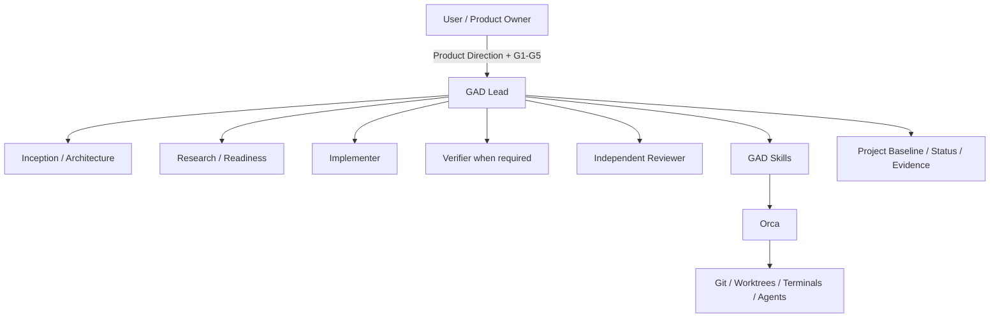
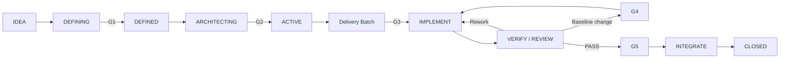

# gad-orca

> **Governed Agentic Delivery for Orca**  
> A human-gated governance and delivery layer for coordinating AI coding agents from idea to verified integration.

`gad-orca` 是运行在 [Orca](https://github.com/stablyai/orca) 之上的 **Governed Agentic Delivery（GAD）治理与自动化交付层**。

它的目标不是再造一个 Agent Framework，也不是替代 Orca，而是解决一个更实际的问题：

> 当多个 AI Coding Agent 开始参与真实软件开发后，谁来持续恢复项目状态、约束范围、安排 Worker、核验证据、处理 Review / Rework、控制变更，并在关键节点把决策权明确交还给人？

`gad-orca` 的答案是：**GAD Lead + GAD Skills + Human Gates + Orca automation**。

---

## 目录

- [为什么需要 gad-orca](#为什么需要-gad-orca)
- [核心目标](#核心目标)
- [它不是什么](#它不是什么)
- [核心架构](#核心架构)
- [GAD Lead](#gad-lead)
- [GAD Skills](#gad-skills)
- [Human Gates：G1–G5](#human-gatesg1g5)
- [运行模式](#运行模式)
- [Agent Preference](#agent-preference)
- [项目生命周期](#项目生命周期)
- [仓库结构](#仓库结构)
- [当前状态](#当前状态)
- [环境要求](#环境要求)
- [快速开始](#快速开始)
- [使用说明](#使用说明)
- [常用命令](#常用命令)
- [典型工作流](#典型工作流)
- [独立 Review 与证据](#独立-review-与证据)
- [状态恢复](#状态恢复)
- [安全与权限模型](#安全与权限模型)
- [故障排查](#故障排查)
- [已知限制](#已知限制)
- [Lean GAD Operations](#lean-gad-operations)
- [路线图](#路线图)
- [贡献](#贡献)
- [许可证](#许可证)

---

## 为什么需要 gad-orca

AI Coding Agent 已经可以独立完成大量编码工作，但真实项目中的难点通常不只是“写代码”。

当项目进入持续交付后，用户经常需要手工承担这些工作：

- 创建和管理 Git Worktree；
- 给不同 Agent 复制 Prompt；
- 在 Agent 之间转发信息；
- 决定下一名 Worker 应该是谁；
- 判断一个 Worker 的“完成”是否真的等于可接受；
- 处理 Review Fail / Rework；
- 判断什么时候需要改变 Baseline；
- 判断什么时候必须停下来让人批准；
- 在上下文重置后恢复项目真实状态；
- 防止 Agent 越过已经批准的范围；
- 维护实现、验证、Review、Integration 之间的证据链。

如果这些事情继续由人手工完成，那么“多 Agent”很容易变成：

```text
用户
├── 创建 Worktree
├── 复制 Prompt
├── 转发 Worker 输出
├── 判断下一步
├── 追踪 Git 状态
└── 充当所有 Agent 的消息总线
```

`gad-orca` 希望把它变成：

```text
用户
 │
 │ 产品方向 / Human Gate
 ▼
GAD Lead
 │
 ├── Inception / Architecture
 ├── Research / Readiness
 ├── Implementer
 ├── Independent Reviewer
 └── Governance / Integration
```

用户不再承担日常 Agent 协调，但仍然保留关键决策权。

---

## 核心目标

`gad-orca` 的核心不是“让 Agent 做更多”，而是：

1. **让一个 GAD Lead 成为项目唯一日常协调入口**；
2. **让 Worker 在隔离、可审查的上下文中完成专职工作**；
3. **让重要项目事实写入 Git / Baseline，而不是只存在于聊天上下文**；
4. **让 G1–G5 Human Gates 始终由用户明确批准**；
5. **让 Review Fail、Rework、Controlled Change、Integration 有稳定路径**；
6. **让 Lead 可以从 Git、Baseline、Orca 和证据中恢复状态，而不是依赖旧对话记忆**；
7. **在提高自动化的同时，保持人类对关键范围和风险的控制**。

一句话概括：

> **Human-gated autonomy, not unattended autonomy.**

---

## 它不是什么

`gad-orca` 当前明确不定位为：

- 通用 Agent Framework；
- Orca 的替代品；
- 自动模型评分或模型路由平台；
- 云端多租户控制平面；
- 自动批准 G1–G5 的无人值守系统；
- “保证没有 Bug”的安全认证系统；
- 为尚不存在的第二 Orchestrator 预建的大型 Adapter Framework。

设计原则：

> **Extensible, not speculative.**

---

## 核心架构



职责边界：

### Orca 负责

- Repo / Worktree 管理；
- Terminal；
- Agent 启动；
- Worker 隔离；
- Orchestration primitive；
- 实际运行环境。

### GAD 负责

- 项目生命周期；
- 项目定义与架构边界；
- G1–G5；
- Research / Readiness；
- Worker 决策；
- Scope / Risk / Evidence 治理；
- Independent Review；
- Rework / Controlled Change；
- Acceptance / Integration / Close；
- Recovery / Reflection / Decision。

### 用户负责

- 产品方向；
- 重大范围决定；
- Human Gates；
- 必须由人承担的高风险决策。

---

## GAD Lead

GAD Lead 是项目的长期协调者和治理者，而不是普通 Implementer。

它的核心闭环是：

```text
RECONCILE
→ REFLECT
→ DECIDE
→ GATE / DISPATCH / BLOCK
→ MONITOR
→ VERIFY
→ REVIEW
→ PACKAGE
→ CLOSE
```

### RECONCILE

恢复当前真实项目状态：

- 正式 Project Baseline；
- `PROJECT_STATUS.md`；
- Git HEAD / Branch / Worktree；
- Orca Worktree / Terminal；
- 当前 Batch；
- Review / Rework / Gate 历史；
- 当前 blocker；
- 尚未完成的合法动作。

### REFLECT

Lead 在执行前必须检查：

- Goal Alignment；
- Fastest Valid Path；
- Minimum Sufficient Scope；
- 是否过度设计；
- 是否过度治理；
- 是否需要新 Worktree；
- 是否可以复用现有 Worker；
- Evidence 是否充分；
- Human Authority 是否被保留；
- Blast Radius / Rollback；
- Source of Truth 是否明确。

### DECIDE

典型结论包括：

- `PROCEED`
- `PROCEED_WITH_CONSTRAINTS`
- `SIMPLIFY`
- `REUSE_EXISTING`
- `RESEARCH_FIRST`
- `CREATE_INDEPENDENT_REVIEW`
- `ESCALATE_TO_USER`
- `BLOCK`

---

## GAD Skills

当前项目包含 5 个核心 GAD Skills：

### `gad-governance`

负责：

- 项目生命周期；
- Gate；
- C/R/P 治理；
- Artifact ownership；
- Controlled Change；
- Acceptance / Close；
- GAD 方法演进边界。

### `gad-project-inception`

负责：

- 项目定义；
- 用户 / 问题 / Scope；
- Success Criteria；
- Project Definition Proposal；
- G1 准备。

### `gad-system-architecture`

负责：

- 系统边界；
- 模块职责；
- 关键契约；
- 架构决策；
- G2 Architecture Baseline 准备。

### `gad-implementation-readiness`

负责：

- Delivery Batch；
- 实现边界；
- Capability / Dependency；
- Verification Contract；
- Parallelization；
- G3 Readiness。

### `gad-solution-research`

负责：

- 方案研究；
- 候选技术评估；
- 来源与证据；
- 在真正需要 Research 时提供有界研究。

Skills 安装在：

```text
.agents/skills/
```

---

## Human Gates：G1–G5

GAD 的核心约束之一是：**Lead 不能自我批准 Human Gate。**

| Gate | 作用 |
|---|---|
| **G1** | 批准项目定义：项目是什么、服务谁、解决什么问题、首期范围是什么 |
| **G2** | 批准项目级 Architecture / Governance Baseline |
| **G3** | 批准某个 Delivery Batch 的精确执行基线 |
| **G4** | 批准对已经生效的 Baseline / Governance 的受控变更 |
| **G5** | 验收精确实现并授权限定 Integration / Closure |

一个 Worker 说 `DONE`，不等于项目已经 Acceptance。

```text
WORKER_DONE
≠ REVIEW_PASS
≠ G5 APPROVED
≠ INTEGRATED
```

---

## 运行模式

GAD Lead 当前支持三种运行模式。

### Shadow

用于只读接管与恢复。

```text
RECONCILE
→ REFLECT
→ DECIDE
→ report
→ stop
```

Shadow 不创建普通 Worker、不修改文件、不推进 Gate。

### Bootstrap

用于：

- 新项目正式 Project Baseline 建立前；
- 已存在项目正式采用 GAD Lead 的治理迁移。

允许协调 Inception / Architecture / Governance / Adoption 类工作，但不能越过 Human Gate。

### Active

项目完成 G1 / G2 并正式批准 Active Mode 后的日常运行模式。

Active 负责完整 Delivery Batch 生命周期。

---

## Agent Preference

不同职责可以由不同 Agent 承担。

配置文件：

```text
gad-lead/GAD_AGENT_POLICY.conf
```

示例：

```ini
lead = claude
implementation = codex
review = claude
other = default
```

也可以全部使用 Codex：

```ini
lead = codex
implementation = codex
review = codex
other = codex
```

当前角色：

- `lead`
- `implementation`
- `review`
- `other`

查看解析结果：

```powershell
.\gad-lead\gad-lead.cmd agent --role lead
.\gad-lead\gad-lead.cmd agent --role implementation
.\gad-lead\gad-lead.cmd agent --role review
.\gad-lead\gad-lead.cmd agent --role other
```

重要语义：

- 已运行的 Session 不会因为配置变化自动换 Agent；
- 新 Session / 新 Worker 使用最新 Agent Preference；
- 无效 / 禁用 / 不可用 Agent 可回退到 Orca Default Agent；
- Agent 相同不代表 Review 不独立，Review 仍必须保持独立上下文和冻结提交边界。

---

## 项目生命周期



项目状态和聊天上下文不是一回事。

项目事实应尽量落在：

```text
PROJECT.md
ARCHITECTURE.md
PROJECT_RULES.md
DEVELOPMENT_WORKFLOW.md
PROJECT_STATUS.md
batches/
Git commits
```

---

## 仓库结构

当前核心布局：

```text
gad-orca/
├── .agents/
│   └── skills/
│       ├── gad-governance/
│       ├── gad-project-inception/
│       ├── gad-system-architecture/
│       ├── gad-implementation-readiness/
│       └── gad-solution-research/
│
├── gad-lead/
│   ├── GAD_AGENT_POLICY.conf
│   ├── GAD_LEAD_OPERATING_MODEL.md
│   ├── INSTALL.md
│   ├── MANIFEST.json
│   ├── README.md
│   ├── SHA256SUMS.txt
│   ├── gad-lead.cmd
│   ├── gad-project.cmd
│   └── tools/
│       ├── gad-lead.ps1
│       └── gad-project.ps1
│
├── batches/                  # Delivery Batch baselines/results
├── PROJECT.md                # Project Definition
├── ARCHITECTURE.md           # Architecture Baseline
├── PROJECT_RULES.md          # Project governance rules
├── DEVELOPMENT_WORKFLOW.md   # Delivery workflow
├── PROJECT_STATUS.md         # Recoverable current state
└── README.md
```

开发中的 Lean GAD 版本还会引入 deterministic control-plane 与聚焦生命周期测试。

---

## 当前状态

`gad-orca` 当前处于 **pre-release / dogfooding** 阶段。

已经经过真实流程验证的能力包括：

- GAD Lead Shadow / Bootstrap / Active；
- 5 个 GAD Skills；
- G1–G5；
- Project Baseline；
- Delivery Batch；
- Agent Preference；
- Worker orchestration；
- Independent Review；
- Review Fail → Rework；
- G4 Controlled Change；
- G5 Acceptance / Integration；
- 无 Git HEAD 的空仓库 Bootstrap 修复；
- `core.autocrlf=true` 下的 Bootstrap 字节一致性验证；
- Lead retry / reuse；
- `doctor` / `status` / Recovery。

正在进行的重点改进：

> **Lean GAD Operations** —— 减少 Worker、Worktree、Branch、机械 Agent、过度测试和用户操作负担。

当前还没有正式的 `v0.1.0` Release Tag。

---

## 环境要求

当前首期验证环境：

- Windows 10 / 11；
- Windows PowerShell 5.1+；
- Git；
- Orca；
- 至少一个 Orca 可启动的 AI Coding Agent；
- Codex 已作为当前主要验证 Agent；
- Claude 可通过 Agent Preference 使用，但不是当前发布阻断条件。

建议先确认：

```powershell
git --version
orca --version
codex --version
```

如果使用 Claude：

```powershell
claude --version
```

---

# 快速开始

> **注意：当前仍是 pre-release。安装/升级体验还在 LEAN-04 中继续简化。下面是当前开发版的真实使用方式。**

## 1. 获取 gad-orca

```powershell
git clone https://github.com/sailorinfo/gad-orca.git
cd gad-orca
```

查看工具帮助：

```powershell
.\gad-lead\gad-project.cmd --help
.\gad-lead\gad-lead.cmd --help
```

查看版本：

```powershell
.\gad-lead\gad-project.cmd version
.\gad-lead\gad-lead.cmd version
```

---

## 2. 安装到已有 Git 项目

当前安装器支持 `init`。

```powershell
<gad-orca-path>\gad-lead\gad-project.cmd init `
  --project C:\path\to\your-project `
  --gad-core C:\path\to\gad-core `
  --package <gad-orca-path>\gad-lead `
  --commit `
  --start-lead `
  --mode bootstrap
```

说明：

- `--project`：目标 Git 项目；
- `--gad-core`：当前开发版 GAD Skills source；
- `--package`：`gad-lead/` 包目录，或包含它的父目录；
- `--commit`：建立必要的安装提交；
- `--start-lead`：安装后启动 GAD Lead；
- `--mode bootstrap`：新接入项目从 Bootstrap 开始。

安装器不会静默覆盖不一致的已有文件；遇到冲突应停止并检查，而不是强制覆盖。

> `--gad-core` 的外部 source 依赖是当前 pre-release 安装流程的一部分，后续 LEAN-04 会继续简化为更直接的开源安装体验。

---

## 3. 创建新项目

```powershell
<gad-orca-path>\gad-lead\gad-project.cmd new `
  --name my-project `
  --parent C:\Projects `
  --gad-core C:\path\to\gad-core `
  --commit `
  --start-lead `
  --mode bootstrap
```

`new` 用于新建 Git 项目并安装 GAD Lead + Skills。

---

## 4. 首次启动 GAD Lead

如果 GAD 已安装，但 Lead Worktree 尚不存在：

```powershell
.\gad-lead\gad-lead.cmd start --mode bootstrap --activate
```

`start` = 第一次创建 Lead。

如果 Lead Worktree 已经存在：

```powershell
.\gad-lead\gad-lead.cmd resume --mode bootstrap --activate
```

或 Active 项目：

```powershell
.\gad-lead\gad-lead.cmd resume --mode active --activate
```

运行中的 Lead 需要切换模式时：

```powershell
.\gad-lead\gad-lead.cmd transition --mode active --activate
```

记忆方式：

```text
第一次创建 Lead       → start
Lead 已存在，继续工作  → resume
运行中改变模式         → transition
```

---

## 5. 检查健康状态

```powershell
.\gad-lead\gad-lead.cmd doctor
```

理想情况下：

```text
errors = 0
warnings = 0
```

新 IDEA 阶段项目可能因为 `PROJECT.md`、`ARCHITECTURE.md`、`PROJECT_STATUS.md` 尚未建立而出现预期 warning。

查看状态：

```powershell
.\gad-lead\gad-lead.cmd status
```

---

# 使用说明

## 1. 日常使用只和 GAD Lead 对话

推荐工作方式：

```text
你 ↔ GAD Lead ↔ Workers
```

不要把用户重新变成 Agent 之间的消息总线。

例如，你可以直接告诉 Lead：

```text
我要给这个项目增加用户登录。
先分析需求和影响范围，不要直接实现。
```

Lead 应自己：

1. 恢复当前项目事实；
2. 判断是否需要 Inception / Architecture / Research；
3. 定义 Delivery Batch；
4. 形成 Readiness；
5. 在需要 Human Gate 时提交 Decision Package；
6. 获批后派发 Implementer；
7. 等待并核验结果；
8. 安排独立 Review；
9. Review Fail 时路由 Rework；
10. 最终提交 G5。

---

## 2. 用户需要做什么

正常情况下，用户只需要：

- 提供产品方向；
- 回答真正需要人的需求问题；
- 审批 G1–G5；
- 对重大范围变化做选择；
- 处理 Lead 无法自行完成的外部权限操作，例如 GitHub 登录。

用户不应该长期承担：

- 手工创建普通 Worker Worktree；
- 给 Worker 复制 Prompt；
- 在 Worker 之间转发输出；
- 手工决定下一名 Worker；
- 日常清理 Worker Terminal；
- 为机械状态更新创建额外 Agent。

---

## 3. 如何批准 Gate

GAD Lead 会给出精确批准对象和建议回复文本。

示例：

```text
批准 G3：以提交 <commit> 中的 <proposal> 作为精确执行基线，
授权其中限定的实现和验证动作。
```

批准时应确认：

- 对象是否精确到 commit / blob / hash；
- Scope 是否清晰；
- 明确不授权什么；
- 是否仍保留后续 Gate；
- Rollback / stop condition 是否明确。

不要用模糊的：

```text
“都可以，继续吧”
```

来替代高治理 Gate 的精确批准。

---

## 4. Human Gate 之后

批准 Gate 后，用户通常不需要继续手工调度。

正确行为：

```text
Gate APPROVED
→ Lead 自动继续合法动作
→ Worker
→ Verify
→ Review
→ 下一 Human Gate / 真正 Blocker
```

如果没有 Human Gate、真正 blocker 或 mode boundary，Lead 不应该停在：

```text
“下一步建议……”
```

而应该继续执行。

---

## 5. Review Fail 时

Review Fail 不代表项目失败。

典型路径：

```text
REVIEW_FAIL
→ Lead 判断：Rework / G4 / Block
→ 原 Implementer 有界返工
→ 新冻结 commit
→ 独立 Re-review
```

不要为了“让 Review 通过”偷偷改变正式 Baseline。

如果 Review 暴露的是 Baseline 自身矛盾，应进入 G4。

---

## 6. 新 Session / 上下文丢失怎么办

Lead 的恢复不应依赖旧聊天。

重新启动后：

```powershell
.\gad-lead\gad-lead.cmd resume --mode active --activate
```

Lead 应重新执行：

```text
RECONCILE
→ REFLECT
→ DECIDE
```

恢复来源包括：

- Project Baseline；
- `PROJECT_STATUS.md`；
- Git；
- Orca；
- Worker / Review 证据。

---

## 常用命令

### GAD Project

```powershell
.\gad-lead\gad-project.cmd help
.\gad-lead\gad-project.cmd version
.\gad-lead\gad-project.cmd doctor --gad-core <path>
```

初始化已有项目：

```powershell
.\gad-lead\gad-project.cmd init `
  --project <project-path> `
  --gad-core <gad-core-path> `
  --package <package-path>
```

创建新项目：

```powershell
.\gad-lead\gad-project.cmd new `
  --name <name> `
  --parent <parent-path> `
  --gad-core <gad-core-path>
```

常用选项：

```text
--commit
--start-lead
--mode shadow|bootstrap|active
--dry-run
--json
```

### GAD Lead

```powershell
.\gad-lead\gad-lead.cmd version
.\gad-lead\gad-lead.cmd doctor
.\gad-lead\gad-lead.cmd status
```

第一次启动：

```powershell
.\gad-lead\gad-lead.cmd start --mode bootstrap --activate
```

恢复：

```powershell
.\gad-lead\gad-lead.cmd resume --mode active --activate
```

模式切换：

```powershell
.\gad-lead\gad-lead.cmd transition --mode active --activate
```

Agent 解析：

```powershell
.\gad-lead\gad-lead.cmd agent --role lead
.\gad-lead\gad-lead.cmd agent --role implementation
.\gad-lead\gad-lead.cmd agent --role review
.\gad-lead\gad-lead.cmd agent --role other
```

结构化输出：

```powershell
.\gad-lead\gad-lead.cmd agent --role lead --json
```

---

## 典型工作流

### 场景 A：从零开始一个项目

```text
IDEA
↓
GAD Lead Bootstrap
↓
Project Inception
↓
G1
↓
Architecture / Governance
↓
G2
↓
ACTIVE
↓
Delivery Batch
↓
G3
↓
Implementation
↓
Independent Review
↓
G5
↓
Integration
↓
CLOSED
```

### 场景 B：已有项目增加功能

```text
User: “增加用户登录”
↓
Lead RECONCILE
↓
Scope / Risk / Readiness
↓
G3
↓
Implementer
↓
Review
↓
Rework if needed
↓
G5
↓
Integration
```

### 场景 C：Review 发现 Baseline 冲突

```text
Review
↓
发现“要求确定性失败注入”
但 production path 明确禁止 injection
↓
不是偷偷改代码绕过去
↓
G4 Controlled Change
↓
Human Approval
↓
重新验证
```

---

## 独立 Review 与证据

GAD 把“实现”和“验收”分开。

Independent Review 至少应满足：

- 审查冻结的精确实现 commit；
- Reviewer 不依赖 Implementer 的聊天上下文；
- Reviewer 不在审查过程中修改实现；
- Review 结果绑定精确代码对象；
- 同模型 Review 也必须保持上下文 / 证据独立。

如果同 Worktree 的独立 Session 无法实证保证必要隔离，可以使用独立 Review Worktree。

证据重点不是“越多越好”，而是：

> **足以证明批准风险已经被覆盖。**

---

## 状态恢复

GAD 项目不应把“当前状态”只留在聊天里。

建议正式事实优先级由项目治理文件定义，一般包括：

```text
Git / exact commit
Project Baseline
PROJECT_STATUS.md
Batch baseline / result
Verified evidence
Orca runtime state
Worker report
Chat summary
```

聊天摘要不能替代当前 Git 和正式 Baseline。

---

## 安全与权限模型

### 1. GAD Lead 不能自批 G1–G5

任何 Agent 都不能把自己的建议当成人类批准。

### 2. 精确审批对象

高治理操作应尽量绑定：

- commit；
- Git blob；
- SHA256；
- 精确文件范围；
- 明确授权动作。

### 3. Fail Closed

如果：

- 状态不明确；
- Worktree 身份不明确；
- Evidence 不完整；
- Gate 不存在；
- 对象发生漂移；

控制动作应停止，而不是猜测。

### 4. Agent 权限

`gad-orca` 使用 Orca 配置的 Agent launcher。Agent 可能拥有较高的本机、Git 和文件权限。

请只在你信任的项目和环境中运行，并正确理解 Orca / Agent 本身的权限设置。

### 5. GAD 不是安全保证

GAD 提供的是：

- 显式治理；
- Evidence；
- Independent Review；
- Human Authority；
- 可恢复流程。

它不保证软件没有缺陷，也不替代安全审计、测试和专业判断。

---

## 故障排查

### `No gad-lead Worktree exists. Use start.`

原因：第一次启动却使用了 `resume`。

解决：

```powershell
.\gad-lead\gad-lead.cmd start --mode bootstrap --activate
```

---

### Lead 已存在，需要继续

```powershell
.\gad-lead\gad-lead.cmd resume --mode active --activate
```

---

### Agent Preference 没按预期解析

检查：

```powershell
.\gad-lead\gad-lead.cmd doctor
.\gad-lead\gad-lead.cmd agent --role lead
```

然后检查：

```text
gad-lead/GAD_AGENT_POLICY.conf
```

---

### Claude 不可用 / Token 不足

可以把 Role 改成 Codex：

```ini
lead = codex
implementation = codex
review = codex
other = codex
```

修改后，新 Session 使用新配置；已有 Session 不会热切换。

---

### GitHub Push 认证失败

如果使用 GitHub CLI：

```powershell
gh auth login --web --git-protocol https
gh auth setup-git
gh auth status
```

完成认证后再让 Lead 按已经批准的精确 push 对象执行远程同步。

不要因为认证失败改用强制 push。

---

### LF / CRLF warning

Windows 上可能看到：

```text
LF will be replaced by CRLF
```

这通常是 Git 换行策略提示，但对于**字节级 SHA256 / package integrity** 可能产生真实影响。

如果出现跨 Worktree hash mismatch：

- 检查 `git config --get core.autocrlf`；
- 区分 Git blob bytes、Release package bytes 和 working tree bytes；
- 不要为了让 hash 通过而盲目重新生成清单；
- 先确认项目定义的 canonical hash domain。

---

### `doctor` 有 IDEA 阶段 warning

新项目尚未建立：

```text
PROJECT.md
ARCHITECTURE.md
PROJECT_RULES.md
DEVELOPMENT_WORKFLOW.md
PROJECT_STATUS.md
```

时，相关 warning 可能是正常的。

应由 Project Inception / G1 / G2 建立正式 Baseline，不要手工伪造通过状态。

---

## 已知限制

当前 pre-release 版本仍有以下限制：

1. **Windows-first**：首期主要验证 Windows + PowerShell；
2. **Orca-only**：目前不承诺其他 Orchestrator；
3. **安装仍偏开发者体验**：当前 `gad-core` source / package 参数还需要进一步简化；
4. **尚无正式 v0.1.0 Release**；
5. **Review Session 隔离能力依赖 Orca 实际能力**，必要时仍需 Review Worktree；
6. **Lean GAD Operations 仍在开发**；
7. **升级 / Migration 还没有最终的一键流程**；
8. **跨平台 package hash 语义仍需进一步标准化**；
9. 当前仍可能存在过度治理、Session churn 等问题，Lean GAD 正在针对这些真实 dogfood 证据优化。

---

# Lean GAD Operations

第一轮真实 dogfood 暴露出一个重要问题：

> 治理成本本身也必须被治理。

一个相对小的 Bootstrap Batch 曾经产生过多 Worker、Worktree、Branch、Verifier / Re-verifier、Status / Promotion / Cleanup / Closure Agent 和临时测试仓库。

因此项目正在推进 **Lean GAD Operations**。

核心目标：

> 在不降低 Human Authority、Evidence、Independent Review 和项目可恢复性的前提下，显著降低流程耗时、Worker 数、Worktree / Branch 数、测试成本和用户操作负担。

当前优化主题：

### LEAN-01 Runtime & Lifecycle

- Worktree Budget；
- Branch Budget；
- `REUSE_BEFORE_CREATE`；
- Worker Role Consolidation；
- deterministic control-plane；
- Terminal / Worktree / Branch lifecycle；
- Evidence retention / archive / delete。

### LEAN-02 Proportional Governance

计划引入：

```text
QUICK
STANDARD
STRICT
CRITICAL
```

以及：

- Risk → Verification 映射；
- Minimum Sufficient Verification；
- Stop Test Expansion；
- Governance cost reflection。

### LEAN-03 Direct Lead UX

目标：

```text
User ↔ GAD Lead
```

包括：

- User Handoff Contract；
- No Dead-End Stop；
- Gate Decision Advisor；
- 中文用户交互；
- 降低用户对 Orca / Git 内部细节的认知负担。

### LEAN-04 Bootstrap & Open-source UX

目标：

```text
gad init .
```

最终希望自动完成：

```text
install
→ Git bootstrap
→ Orca registration
→ Lead creation
→ Lead start
```

并完善：

- upgrade；
- migration；
- compatibility check；
- public release packaging。

---

## 路线图

### v0.1 目标

- [x] GAD Lead Operating Model
- [x] 5 个 GAD Skills
- [x] Shadow / Bootstrap / Active
- [x] G1–G5
- [x] Agent Preference
- [x] Orca Worktree coordination
- [x] Independent Review / Rework
- [x] no-HEAD Bootstrap dogfood
- [ ] LEAN-01 Runtime & Lifecycle 完成
- [ ] LEAN-02 Proportional Governance
- [ ] LEAN-03 Direct Lead UX
- [ ] LEAN-04 Bootstrap / OSS UX
- [ ] 第三方 clean-machine 安装验证
- [ ] License
- [ ] Security / Contribution 文档
- [ ] CI / regression
- [ ] `v0.1.0` Release

---

## 贡献

项目当前仍处于早期 dogfooding 阶段。

欢迎关注或参与：

- GAD methodology；
- Orca coordination；
- Human-gated Agent delivery；
- Lean multi-agent workflow；
- Windows / PowerShell bootstrap；
- Review / Evidence / Gate design。

在正式 `CONTRIBUTING.md` 建立前，建议先通过 GitHub Issue 描述：

- 问题；
- 复现方式；
- 当前行为；
- 期望行为；
- 是否涉及 Human Gate / Evidence / Worktree lifecycle。

Repository：

```text
https://github.com/sailorinfo/gad-orca
```

---

## 许可证

当前仓库已经公开，但正式开源许可证尚未在本 README 中宣称。

> **在 `LICENSE` 文件正式加入仓库之前，请不要假设某个具体开源许可证已经生效。**

正式 `v0.1.0` 发布前应明确许可证并加入仓库；项目当前建议评估 Apache-2.0 或其他适合治理工具与自动化基础设施的许可证。

---

## 项目理念

`gad-orca` 想解决的不是：

> “如何让 AI Agent 永远不停地工作？”

而是：

> “如何让 AI Agent 可以持续交付，同时让项目事实可恢复、证据可检查、复杂度可控制，并且关键决定始终由人掌握？”

最终期望的使用体验很简单：

```text
你告诉 GAD Lead 想做什么
↓
Lead 恢复项目状态
↓
Lead 自己协调必要 Worker
↓
需要真正的人类决定时才找你
↓
你批准 / 修改 / 拒绝
↓
Lead 继续
```

**让人从 Agent 消息总线中退出，但不从关键决策中退出。**
